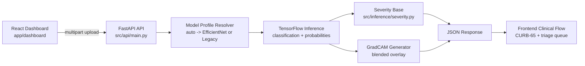

# MRF Scan

Chest X-ray pneumonia analysis dashboard with FastAPI inference, React clinical workflow UI, and GradCAM explainability.

[](https://www.python.org/)
[](https://fastapi.tiangolo.com/)
[](https://www.tensorflow.org/)
[](https://react.dev/)
[](https://vitejs.dev/)

## Why This Project Exists

MRF Scan is designed as an end-to-end research workflow:

- model inference on chest X-rays
- explainability through GradCAM overlays
- CURB-65 assisted severity scoring
- triage-style queueing in a usable dashboard

This repository is open source for experimentation, learning, and iteration.

## Core Features

- 3-class classification:
  - NORMAL
  - BACTERIAL_PNEUMONIA
  - VIRAL_PNEUMONIA
- Explainability:
  - GradCAM blended overlay for each uploaded image
  - EfficientNet path locked to top_conv for stable maps
- Clinical support:
  - CURB-65 form with explicit urea unit support (mmol/L or mg/dL/BUN)
  - Combined severity score and interpretation
- Workflow UI:
  - analysis mode + triage mode
  - browser-persisted queue for local testing

## Model Architecture and Training Story

This repo currently supports two inference profiles in backend:

1. efficientnet_colab (default for best_model_final.keras)
2. legacy_mobilenet (compatibility path with CLAHE + MobileNet preprocessing)

In practice, the production path in this project uses an EfficientNetB3 transfer-learning model artifact when profile auto-detection resolves to efficientnet_colab.

High-level transfer-learning pattern used in this project family:

- pretrained CNN backbone
- frozen warm-up stage
- task-specific head for 3-way classification
- selective fine-tuning for better domain adaptation

GradCAM path for EfficientNet profile uses backbone top_conv explicitly for consistency with notebook validation runs.

## System Architecture



## Repository Structure

```text
pneumonia_ai/
  app/dashboard/                 React + TypeScript frontend
    src/components/              Dashboard UI pieces
    src/pages/                   Main and triage pages
    src/services/api.ts          Frontend API adapter
    src/utils/severity.ts        CURB-65 + combined severity logic
  src/api/main.py               FastAPI entrypoint
  src/explainability/           GradCAM helpers
  src/data/                     Data loading/preprocessing utilities
  src/models/                   Training/eval scripts
  src/inference/                Inference helpers
  models/final/                 Model artifacts
  docs/                         Supplementary notes
```

## Quick Start

### 1) Clone

```bash
git clone https://github.com/hydralgorithm/mrf_scan.git
cd mrf_scan
```

### 2) Backend setup

```bash
python -m venv .venv
```

PowerShell:

```powershell
.\.venv\Scripts\Activate.ps1
pip install -r requirements.txt
```

### 3) Frontend setup

```powershell
Set-Location app/dashboard
npm install
Set-Location ../..
```

### 4) Data/model assets

- If data.zip exists, extract at repo root.
- Ensure models are present under models/final.

## Run Locally

Use two terminals.

### Terminal A: backend

```powershell
Set-Location "C:\path\to\pneumonia_ai"
.\.venv\Scripts\Activate.ps1
python src/api/main.py
```

Alternative:

```powershell
python -m uvicorn src.api.main:app --host 0.0.0.0 --port 8000 --reload
```

### Terminal B: frontend

```powershell
Set-Location "C:\path\to\pneumonia_ai\app\dashboard"
npm run dev
```

Local URLs:

- frontend: http://localhost:5173
- api docs: http://localhost:8000/docs
- health: http://localhost:8000/health

## API Reference

### POST /predict

Upload key: file (image/*)

Response fields:

- classification
- confidence
- probabilities
- base_severity
- class_index
- gradcam_overlay (base64 data URL when available)
- gradcam_error (string or null)

### GET /health

Returns:

- status
- model_loaded
- model_path
- model_profile
- inference_img_size
- model_output_labels

## Configuration

Frontend reads API base from VITE_API_URL.

- fallback default: http://localhost:8000
- implementation: app/dashboard/src/services/api.ts

Backend supports:

- MODEL_PATH
- MODEL_PROFILE: auto | efficientnet_colab | legacy_mobilenet

## Deployment Notes

You can deploy frontend to Vercel while backend stays local for testing.

Flow:

1. run backend locally
2. expose backend via tunnel
3. set VITE_API_URL to tunnel URL in Vercel

If backend/tunnel stops, deployed frontend cannot call API until restarted.

## Current Constraints

- Triage queue is localStorage-based (browser-local, not shared backend state).
- This is not a clinical-grade medical device pipeline.
- Model behavior and thresholds are still evolving.

## Open Source Roadmap (Suggested)

- add LICENSE (MIT recommended)
- add CONTRIBUTING.md with coding standards and PR checklist
- add SECURITY.md and issue templates
- publish reproducible training/eval notebook summary

## Contributing

PRs are welcome:

1. fork
2. branch
3. implement + test
4. open PR with before/after behavior notes

## Medical Disclaimer

This software is for research and educational use only.
Do not use it as a sole basis for diagnosis, treatment, or patient safety decisions.
